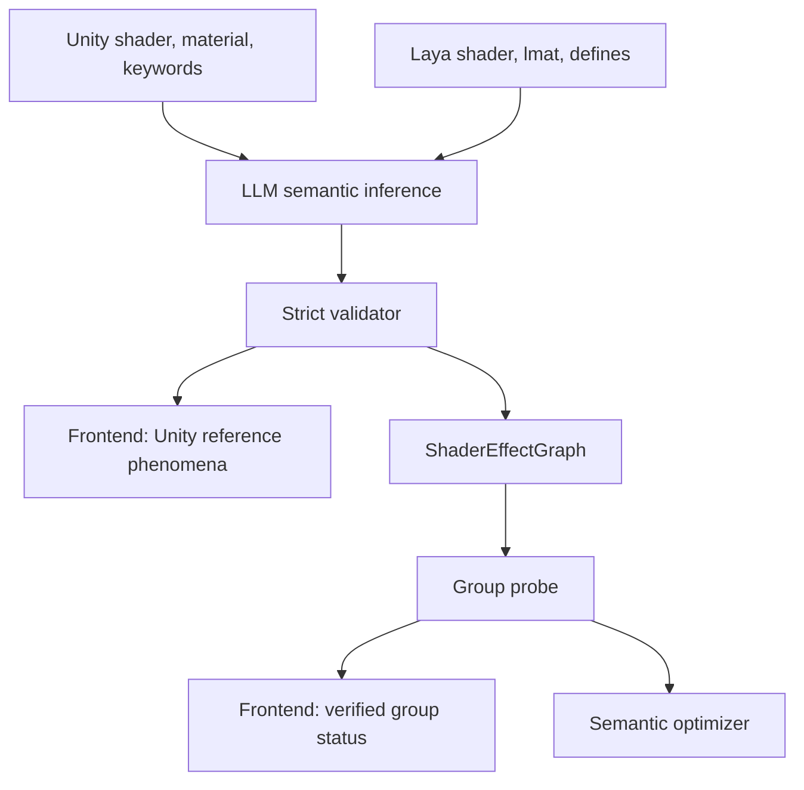

# 优化调整算法重设计方案

> 状态：设计评审稿。  
> 目的：解释本轮算法重设计的完整思路、已落地的原型骨架、与既有科研方案的关系，以及下一步应该如何验证和取舍。  
> 重要说明：本文档讨论的是“下一阶段优化算法应该如何设计”。当前代码中新增的 `semantic_graph`、`group_probe`、`semantic_group` 等实现应视为可运行原型和数据结构骨架，不应直接等同于最终算法结论。尤其是当前基于命名的语义推断只能作为 fallback，正式主路径应改为 LLM 读取 Unity/Laya shader 后输出结构化语义。

## 1. 背景与问题

我们的问题不是简单的“给一组参数找最优值”。它更接近 `CrossEngineMaterialFit_Research.md` 中形式化的高维、昂贵、不可导黑盒逆问题：

```text
theta* = arg min L(R_laya(theta), I_unity_ref)
```

这里的难点有四个：

1. **参数空间异质**：颜色参数通常在 `[0,1]`，强度可能在 `[0,8]` 或 `[0,10]`，角度可能是 `[0,360]`，阈值和平滑度常在 `[0,1]`。如果统一用原始数值空间搜索，某些轴会因为尺度太大主导优化器。
2. **参数不是独立生效**：很多参数由 define 或强度参数门控。例如 `u_FresnelIntensity = 0` 时，`u_FresnelColor`、`u_FresnelSmooth`、`u_FresnelPow` 的变化可能完全不可见。
3. **参数是成组作用的**：金属感、高光、Matcap、Fresnel、Emission 等效果通常由一组参数共同决定，单参数坐标下降很容易误判“这个参数没用”。
4. **每次评估很贵**：真实 Laya 闭环需要写 `.lmat`、等待刷新、截图、评分。预算大概率只有几十到一两百次，不能在无效维度上浪费。

所以当前主线不应该是“启发式 vs CMA-ES 二选一”，而应该是先建立 shader 语义层，把原始参数列表转化为有结构的、低维的、可解释的搜索问题。

## 2. 现有方案的问题

### 2.1 当前 heuristic 的问题

`optimizer/adjustment_algorithm.py` 里的 heuristic 是固定 stage 表：

- `base_color`
- `shadow_diffuse`
- `specular_smoothness`
- `reflection_matcap`
- `fresnel_emission`
- `global_color_grade`

它的问题不是没有价值，而是“结构是人工写死的”：

- 它假设 FishStandard 风格的参数名和语义。
- 它不知道某个组当前是否被 define 或 gate 参数关闭。
- 它每轮按视觉通道 bias 反向修正，但不能判断一个参数是“没效果”还是“被门控了”。
- 它把多个强耦合参数拆成阶段顺序调，容易错过必须联动的组合。

### 2.2 当前 CMA-ES 的问题

`optimizer/cma_es_optimizer.py` 已经做对了一件关键事：把异尺度参数映射到 `[0,1]`，这正是 `Experiment_Phase1_CMA_ES_WarmStart.md` 中修复异质尺度失败的核心。

但它仍然有三个不足：

- 它主要解决数值尺度，不解决 shader 语义。
- 它会把所有可训练参数放进同一个高维空间，预算低时很浪费。
- 它无法知道哪些参数当前因 define/gate 不生效。

换句话说，CMA-ES 是一个好的局部/全局黑盒优化组件，但它需要一个更聪明的搜索空间生成器。

## 3. 与既有科研方案的关系

### 3.1 Appearance-driven / inverse rendering

`RelatedWork_Survey.md` 指出，最接近我们的学术坐标是 appearance-driven simplification 和 inverse rendering，尤其是 nvdiffmodeling / nvdiffrec 这一线。

可借鉴点：

- 以图像监督驱动材质参数拟合。
- 输出仍然要能进入传统渲染引擎。
- 需要在视觉损失和可解释材质参数之间建立桥梁。

不能直接照搬的地方：

- nvdiffmodeling 假设可微 surrogate renderer。
- 我们当前使用真实 Laya 编辑器在环，是不可导黑盒。

因此短期应该走“语义约束的黑盒优化”，长期再考虑把 FishStandard 子集重写成可微 surrogate。

### 3.2 Warm-start CMA-ES

Nomura et al. 的 WS-CMA-ES 已被我们的合成实验验证过方向正确：好的 prior 能显著减少 CMA-ES 的冷启动浪费。

但对真实 Laya 来说，prior 不应该理解成“把 Unity 参数值迁移到 Laya 参数值”。两个引擎的 shader 实现、光照约定、参数范围和数值意义都不同，同名参数也不保证数值等价。

因此更准确的 prior 应该是“现象先验”和“搜索空间先验”：

- Unity 材质和关键字描述了参考图可能包含哪些现象，例如 emission、rim/fresnel、matcap、HSV、metallic/specular。
- shader 语义图描述 Laya 侧有哪些效果组、哪些 gate/define、哪些参数 shape/color/intensity 共同控制一个效果。
- LLM 可以给出初版参数参考，但它的主要价值是解释 shader 语义和限定搜索空间，而不是直接给最终数值。
- 组级探针得到的“这个组确实影响画面”的证据。

也就是说，下一阶段的 warm-start 不应只是“用历史 params 初始化 CMA”，而应是“用 LLM shader semantic prior 限定搜索子空间，再用组级探针和历史样本初始化局部搜索”。

### 3.3 DiffMat / mixed-integer optimization

`RelatedWork_Survey.md` 已经修正过：DiffMat 不适合作为主干，因为它针对 Substance 节点图，不针对任意 GLSL/Laya shader。

但 DiffMat v2 的 mixed-integer 思想有价值：

- define、bool、枚举、feature 开关是离散变量。
- uniform 数值是连续变量。
- 真实材质拟合是连续 + 离散混合优化。

短期可以不做完整 mixed-integer optimizer，但需要显式把 define/gate 纳入语义图，否则连续优化会在关闭的效果组里白跑。

### 3.4 LLM / VLM 材质语义

`LLMContextPrompt.md` 的原则仍然成立：

- LLM 不直接写 `.lmat`。
- LLM 不进入每轮优化循环。
- LLM 负责解释 shader 语义、识别效果组、识别 define/gate、判断参数角色、输出结构化建议。
- LLM 可以输出“Unity 参考现象描述”和“Laya 初始参数参考”，但这些是搜索先验，不是可直接信任的最终参数。
- 确定性代码负责校验、应用和评分。

这与当前新增的 `llm_semantics.py` 思路一致：模型只能输出 `param_semantics`，并且必须经过 allowed params / allowed defines 校验。

这里需要明确修正一个方向：不要把代码里的模糊命名匹配当作正式语义推断。命名规则适合做单元测试、无 LLM 时的 fallback、以及快速 demo，但它不能真正理解 shader 公式。一旦参数名不规范、历史命名错误、或者不同 shader 使用了局部项目习惯，模糊匹配就会把错误包装成自动化。

正式主路径应是：

```text
Unity shader source + Unity material facts + Laya shader source + Laya lmat facts
  -> LLM semantic inference
  -> strict schema validation
  -> ShaderEffectGraph
  -> group probe and optimizer
```

LLM 输出必须包含证据字段，例如引用它从 shader 中看到的 uniform、define、`#ifdef`、公式片段或材质参数。确定性 validator 不判断“语义是否聪明”，但必须保证模型不能引用不存在的参数、不能引用不存在的 define、不能直接生成写文件动作。

## 4. 目标架构

推荐把算法拆成五层：

```text
Unity/Laya inputs
  -> Shader semantic analysis
  -> Effect graph and parameter transforms
  -> Group activation/probe
  -> Group-level local optimization
  -> Active-subspace global refinement
```

### 4.1 Shader semantic analysis

输入：

- Unity shader 源码或可读的 shader 片段
- Unity material 参数、贴图槽、keyword/feature 开关
- Laya shader 源码、`uniformMap`、`defines`
- Laya `.lmat` 当前 props 和 defines
- 允许的参数名、define 名、贴图名白名单
- 可选：历史拟合结果和人工标注

输出：

- `UnityPhenomenonSummary`：Unity 参考材质呈现了哪些可解释现象。
- `ParamSemantics`：Laya 参数的组、角色、transform、range、gate、依赖关系。
- `ShaderEffectGraph`：效果组、门控、active 状态和候选搜索空间。
- `InitialLayaParamSuggestion`：可选的初版参数参考，供 UI 展示和 warm-start 使用，但不视为最终答案。

每个参数应至少包含：

```jsonc
{
  "name": "u_FresnelColor",
  "type": "Color",
  "group": "fresnel",
  "role": "color",
  "transform": "color_rgb",
  "range": [0, 1],
  "gates": [
    { "kind": "param_nonzero", "name": "u_FresnelIntensity" }
  ],
  "dependencies": ["u_FresnelIntensity"],
  "searchable": true
}
```

同时应输出 Unity 参考现象描述，例如：

```jsonc
{
  "phenomena": [
    {
      "name": "rim_or_fresnel",
      "confidence": 0.82,
      "unity_evidence": ["_RimColor is non-black", "_RimPower exists", "shader uses fresnel term"],
      "laya_candidate_groups": ["fresnel"],
      "note": "Unity values are evidence of an enabled visual effect, not directly transferable numeric targets."
    }
  ]
}
```

这部分应该在前端可见，因为它能帮助使用者理解算法为什么准备打开某个 Laya 效果组，而不是只看到一组难以解释的参数列表。

### 4.2 参数 transform

不同参数不应都走线性 `[0,1]`：

| 参数类型 | 建议 transform | 原因 |
|---|---|---|
| color | `color_rgb` 或未来 `color_hsv` | 保留 alpha，避免透明度漂移 |
| intensity/strength/scale | `log` 或 log-like | 乘法强度更接近人眼和 shader 公式 |
| pow/gamma | `log` | 小值附近敏感，大值附近粗调 |
| hue/angle | `circular` | 0 和 360 相邻 |
| threshold/smoothness/metallic | `linear` | 多数是自然 `[0,1]` 插值 |

当前已改动的 `ParameterEncoder` 只是第一步：支持 `linear/log/circular/color_rgb`。后续还需要验证每种 transform 对真实 Laya 的贡献。

### 4.3 效果组

建议的基础组：

- `base_color`
- `shadow_diffuse`
- `specular_smoothness`
- `reflection_matcap`
- `fresnel`
- `emission`
- `color_grade`
- `misc`

每个组应该有：

- 组内参数
- gate 参数
- define gate
- 对应的图像诊断 channel
- 是否 active
- 为什么 active / inactive

例如：

```jsonc
{
  "name": "fresnel",
  "params": ["u_FresnelIntensity", "u_FresnelColor", "u_FresnelSmooth", "u_FresnelPow"],
  "gate_params": ["u_FresnelIntensity"],
  "define_gates": [],
  "channels": ["fresnel_rim", "center_vs_edge_balance"],
  "active": false,
  "reason": "zero gate params: u_FresnelIntensity"
}
```

### 4.4 前端需要展示的语义信息

既然 Unity 参数不再被当作“可直接迁移的值”，前端就不能只展示 Unity-Laya 参数表。更合理的是展示“参考现象 -> Laya 候选效果组 -> 验证状态”。

建议在 preanalysis 页面或自动调参前的检查页增加三块信息：

- **Unity 参考现象**：由 LLM 总结，例如“存在边缘光倾向”“存在自发光倾向”“高光偏强”“颜色经过 HSV/contrast 调整”。每条包含置信度和证据。
- **Laya 候选效果组**：显示 LLM 认为 Laya 中哪个 group 可以解释该现象，以及需要打开哪些 define/gate。
- **探针验证结果**：组级探针跑完后，把状态从“语义推测”更新为“已验证生效 / 无可测变化 / 被门控 / 当前视角不可见”。

这会把算法从黑盒调参变成可解释流程。用户看到的不是“LLM 猜了某个值”，而是“Unity 参考图疑似有 Fresnel；Laya 有 Fresnel 组；当前 gate 关闭；探针打开后确实影响边缘区域；因此后续优化该组”。

推荐的数据流：



## 5. 推荐优化流程

### 阶段 A：语义初始化

目标不是立刻追分，而是把搜索空间变成“有效参数空间”。

做法：

1. LLM 读取 Unity/Laya shader 和材质事实，输出 Unity 参考现象、Laya 效果组、参数角色、gate/define、初版参数参考。
2. 确定性 validator 校验输出：只接受已知参数、已知 define、合法 range、合法 transform、合法 gate。
3. 如果 Unity 有 emission/rim/HSV 等现象，而 Laya 对应 define 或 gate 关闭，则生成“候选激活”。
4. 不直接大幅调色，只设置最小非零 gate，例如 `u_FresnelIntensity` 从 0 调到一个安全小值。
5. 记录所有激活动作，后续可回滚，并在前端显示为“语义建议”而非“最终参数”。

### 阶段 B：组级探针

每个效果组用 1 到 2 次小扰动验证：

- 这个组的 gate 打开后是否真的影响画面。
- 这个组的变化是否落在截图区域中。
- 这个组的参数是否被 shader 其他逻辑覆盖。

如果一个组的扰动没有产生可测色差，就先从本轮优化预算中移除。

这一步非常关键，因为它避免在无效组上跑 CMA 或坐标搜索。

### 阶段 C：组内低维优化

根据当前 `diff_analysis.material_channels` 找最严重的视觉通道，再映射到效果组。

例如：

| 图像问题 | 优先组 |
|---|---|
| 主体颜色/亮度偏差 | `base_color`, `color_grade` |
| 暗部偏差 | `shadow_diffuse` |
| 高光/金属感偏差 | `specular_smoothness`, `reflection_matcap` |
| 边缘光偏差 | `fresnel` |
| 自发光偏差 | `emission` |

组内维度通常控制在 3 到 8 个，比全局 30 到 60 维更适合真实 Laya 的低预算闭环。

可选算法：

- normalized coordinate search：简单、稳定、易解释。
- pattern search：每组正负方向探测，适合无梯度低预算。
- small CMA-ES：只在组内几维跑，能处理组内耦合。

我更推荐先落地 pattern search / coordinate search，等能稳定改善后，再把 small CMA-ES 作为组内可选策略。

### 阶段 D：active subspace 全局收尾

当组级探针和组内优化已经证明哪些参数有效后，再把这些参数合并成 active subspace。

此时可以跑：

- `cma_warm`，但 param_whitelist 只包含有效参数。
- 或低预算 coordinate refinement。

这样 CMA-ES 学的是“有效低维空间”的协方差，而不是所有 shader 参数的协方差。

## 6. 当前已改动部分的说明

本轮已经写入了一些原型代码。它们的定位如下。

### 6.1 `optimizer/semantic_graph.py`

作用：

- 定义 `ParamSemantics`
- 定义 `ShaderEffectGroup`
- 定义 `ShaderEffectGraph`
- 接收 LLM 输出的参数语义并生成效果图
- 在没有 LLM 输出时，通过名字、类型、defines、当前 `.lmat` 值推导分组和门控，作为 fallback

当前能力：

- 能识别 base/specular/reflection/fresnel/emission/color_grade 等组。
- 能识别 Fresnel intensity gate。
- 能识别 emission / HSV / contrast 的 define gate。
- 能输出 active / inactive 原因。

局限：

- 当前自动推断仍主要是名字启发式，正式路线中必须降级为 fallback。
- 还没有真正解析 GLSL/HLSL 代码中的 `#ifdef` 和公式。
- 对项目自定义 shader 的泛化能力应主要依赖 LLM 读取 shader 源码后的结构化输出，而不是继续堆模糊规则。

### 6.2 `optimizer/cma_es_optimizer.py`

作用：

- 让 `ParameterEncoder` 可接收语义图。
- 支持 `linear/log/circular/color_rgb` transform。
- 可用语义图过滤不可搜索参数。

局限：

- log transform 只是第一版，未经过真实 Laya 校准。
- circular transform 对 hue 的实际取值约定还需要核对 shader 公式。
- 颜色仍是 RGB，未来可能需要 HSV 或亮度/色度分解。

### 6.3 `optimizer/group_probe.py`

作用：

- 为每个效果组生成一个小扰动候选。
- 如果组 inactive 但有 gate 参数，先扰动 gate 参数。
- 通过 mean diff 判断组是否有视觉效果。

局限：

- 目前只是生成候选和评估结果的数据结构。
- 还没有完整接入真实 auto-adjust 主循环做批量组探针。

### 6.4 `optimizer/strategy.py` 中的 `semantic_group`

作用：

- 新增 `semantic_group` 策略入口。
- 每轮根据当前图像 channel 选择一个效果组。
- 在组内选择一个参数轴做小步更新。

局限：

- 这是最小可运行策略，不是最终推荐算法。
- 它还没有记忆组级探针结果。
- 它还没有做组内多方向 pattern search。
- 它还没有做“先激活 gate，再优化组内 shape/color”的完整状态机。

### 6.5 `optimizer/llm_semantics.py`

作用：

- 构建 LLM 语义分析上下文。
- 校验模型输出只包含已知参数和已知 define。
- 限制 LLM 只产出语义建议，不直接写 `.lmat`。
- 承接正式主路径：由 LLM 输出 Unity 现象描述、Laya 效果组、参数角色、gate/define 和初始参数参考。

局限：

- 还没有接任何实际 LLM provider。
- 还没有把 shader 源码片段、公式证据、资源信息完整塞入上下文。

后续接入计划：

- 使用 OpenAI-compatible Chat Completions 接口，配置从 `.env` 读取，例如 `OPENAI_BASE_URL`、`OPENAI_API_KEY`、`OPENAI_MODEL`。
- 后端新增一个 LLM client 层，只负责请求/重试/超时/JSON schema 输出，不把 provider 细节散落到 preanalysis 或 optimizer。
- prompt 明确要求模型只输出 JSON，不输出解释性正文；所有解释性内容必须进入 `reason`、`evidence`、`confidence` 字段。
- validator 对模型输出做白名单过滤，未知参数和未知 define 直接丢弃或标记为 rejected，不进入 `.lmat`。
- LLM 结果应缓存到项目目录中，避免每次打开 UI 或重复 preanalysis 都重新消耗模型调用。

## 7. 推荐下一步

我建议不要马上继续堆实现，而是按下面顺序做验证。

### Step 1：把当前原型固定为实验分支

当前代码有价值，但还应视为实验实现。建议：

- 保留 `semantic_graph`、`llm_semantics`、`group_probe` 作为可测试基础模块。
- 暂时不要把 `semantic_group` 设为默认 optimizer。
- UI 中可以保留选项，但标注为实验。

### Step 2：先验证语义图是否正确

对 `fish_1580` 跑一次 preanalysis，检查：

- LLM 输出的 Unity 参考现象是否符合肉眼和 shader 代码。
- Laya 效果组是否识别正确，尤其是 Fresnel、Emission、Matcap、HSV/contrast。
- define/gate 是否识别正确。
- 哪些参数被判为 searchable / fixed。
- 前端是否能清楚展示“现象 -> 候选组 -> gate/define -> 初始参考”的关系。

这一步不需要跑自动调参，只看语义图是否符合 TA/肉眼理解。

### Step 3：接入 OpenAI-compatible LLM 语义推断

在正式优化前先把 LLM 语义推断链路打通：

1. 从 `.env` 读取 `OPENAI_BASE_URL`、`OPENAI_API_KEY`、`OPENAI_MODEL`。
2. 后端提供 preanalysis 触发 LLM 语义分析的入口。
3. prompt 输入 Unity shader、Unity material facts、Laya shader、Laya lmat facts 和 allowed schema。
4. 模型输出固定 JSON。
5. validator 生成 accepted / rejected 结果。
6. UI 展示 Unity 参考现象、Laya 候选效果组、证据和置信度。

这一步完成后，命名启发式只作为离线 fallback，不再作为真实项目的默认语义来源。

### Step 4：实现真正的组级探针闭环

在正式优化前执行：

1. baseline 截图。
2. 对每个组生成 probe candidate。
3. 写 `.lmat`、截图、还原。
4. 记录每个组的 mean diff / perceptual diff / 是否 active。
5. 把结果写入 `auto_adjust/group_probe.json`。

这是最关键的实验，因为它直接回答：

- 哪些组真的影响画面？
- 哪些组被门控？
- 哪些组在当前截图区域不可见？

### Step 5：把 `semantic_group` 改成状态机

最终 `semantic_group` 应该有状态：

```text
activate_gate -> probe_group -> optimize_group -> mark_done_or_stuck -> next_group
```

而不是现在这样每轮简单选一个 group。

### Step 6：真实 Laya 对照实验

在 `fish_1580` 上跑：

- heuristic
- cma_warm
- semantic_group
- semantic_group + active-subspace cma_warm

每组同样预算，例如 30 或 50 eval，比较：

- 最终 fit_score
- 每 10 eval 的提升曲线
- 人眼截图对比
- 实际改动参数数量
- 是否出现破坏性过调

## 8. 我对下一步算法的明确建议

短期最值得做的是：

1. **先把 ShaderEffectGraph 做准**，不要急着追分。
2. **LLM 作为语义推断主路径**，命名启发式只做 fallback。
3. **Unity 参数值只作为现象证据和初始参考**，不要把它当作可迁移的 Laya 数值答案。
4. **前端要展示现象描述和证据链**，否则用户无法判断算法为什么启用某个效果组。
5. **组级探针优先级高于 optimizer 替换**，因为它能直接减少无效搜索。
6. **组内先用 pattern search / coordinate search**，不要一开始就在组内上 CMA。
7. **CMA-ES 只用于 active subspace 收尾**，不要全维盲搜。
8. **LLM 不做闭环调参**，先不让模型每轮根据截图猜参数。

如果一句话概括：

> 下一版优化器应该是“LLM shader 语义理解 + Unity 现象描述 + shader 语义图 + 组级生效探针 + 组内低维搜索 + 有效子空间 CMA 收尾”，而不是单纯把 heuristic 换成 CMA，或让 LLM 直接猜最终参数。

## 9. 当前原型是否应该保留

我的建议是保留，但要明确标记为实验骨架。

保留理由：

- 它补上了后续算法必须有的数据结构。
- 它不会破坏旧 heuristic / cma 路径。
- 它给 preanalysis、encoder、optimizer、LLM 语义建议之间建立了接口。

需要谨慎的地方：

- `semantic_group` 目前只是最小策略，不应当作为默认算法。
- 语义推断当前仍然依赖命名启发式，正式路线中应替换为 LLM 主路径。
- 当前代码实现早于设计评审，因此后续可根据本文档调整或部分回退。

## 10. 结论

这次重设计的核心不是“更复杂的优化器”，而是“更小、更准、更有效的搜索空间”。

在真实 Laya 闭环里，评估次数太贵，所以算法必须先回答：

- 这个参数组是否生效？
- 它被什么 gate/define 控制？
- 它应该用什么尺度搜索？
- 它对应哪个视觉错误通道？

只有这些问题回答清楚后，CMA-ES、pattern search、坐标搜索、LLM warm-start 才有机会发挥作用。否则优化器会继续在大量无效维度中试错。
